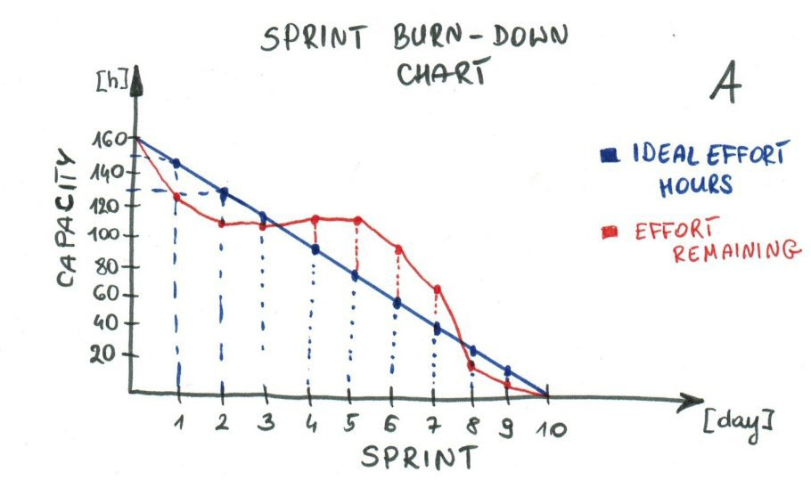

# 1.2 - Understands the process of developing software and whatever responsibilities that are defined are adhered to (e.g. stand ups, commits, pull requests)

- ### 1.2.1 - What is the process around pull requests

    Once a task's worth of work development is considered close to code complete, a pull request is created and relevant development peers are invited to look over the proposed commit(s) to the repository.  This is an opportunity for other developers to comment and highlight things that they feel work well, or indiciate things that could be handled better.

    The developer, whose work is being reviewed, then gets a chance to see how other devs might have handled components of the task, or explain their reasoning behind development decisions.  This process is is also excellent at normalizing coding best practices and foratting.

    Once the development quorum is satisifed that the code meets best practice guidelines, the code can be merged into master and put in the deployment pipleline.

- ### 1.2.2 - What makes up a good commit

    In a perfect world, a commit would contain in entiretey the work performed (add, changes, and deletes) that is defined by the project task.  That way all the interdependent components would be bundled together and all the changes could be seen in a single snapshot or commit.

    In real life, though, it should at least be the amount of work that gets to a logical save point.  For isntance, and sub feature or component that's part of the outline of the task.  Ideally, the project would be in a state that compiles and can be debugged without too much detetcive work to get the project working.

    The most fundamental goal of a commit is to save and protect the work and progress made in the project.  So, if the only thing done is a save of the work for the day and work isn't lost to a crash or malfuntion then the commit has value.

- ### 1.2.3 - Why do we have to reference a Jira item in each commit

    This is to make sure that a commit is mapped properly to the task being worked on. That way no code changes are orphaned from the task it is intended to address and the pull request has all the changes aggregated together to make reviews easier.

- ### 1.2.4 - Understands the scrum process and can describe how it works
  - #### 1.2.4.1 - Participating in standups

    The standup process is important because it allows for small and consistent telemetry updates.  It mitigates a lot of "large" surprise status updates, and helps the team members synchronize their efforts. It also gives interested paarties, that aren't directly involved in the development process, a chance to hear how the work is progressing or answer any immediate questions about specific tasks.

  - #### 1.2.4.2 - Using burndown properly
    
    Burndown charts are a nice way to estimate if the work with in a sprint is likely to be completed.  It's also a nice measure of whether or not a sprint has too much or too little work included.

    

    The ideal effort line in the graph above depicts how much work should remain at any point in teh sprint, if a consistent amount of work or resources is devoted to the sprint.  This is essentially linear function of the amount of work estimated at the beginning of the sprint and the amount of development hours that can be devoted throughout the sprint. This line tells us if a sprint has too much work added in to be completed in the time-frame given.

    It's important to note that in the beginning of the sprint the initial effort estimate is really only a educated guess by the development resources and are probably wrong to some degree. This metric is really a means of trying not to batch together too many large effort tasks, if our development resources are a limiting factor.

    The effort remaining is an estimate of the amount work that still needs to be done by the development resources.  It is measured as the remaining work rather than a metric of time spent, because with a burndown we're more interested in if the sprint work will be completed given the time remaining.
  
    The hope is that the estimated work remaining stays at or under the ideal effort line. It is possible to have wild deviation between the two lines.  If this happens consistently and through several sprints, then the specification gathering phase of the task isn't detailed enough or the estimate of work is being done by the wrong or an inexperienced development resource.

  - #### 1.2.4.3 - Works with the team to continuously improve the development process

  - #### 1.2.4.4 - Can describe the purpose of each scrum meeting

    1. Sprint Planning

    1. Stand-Up

    1. Sprint Review
    
    1. Sprint Retrospective

    1. Backlog Grooming